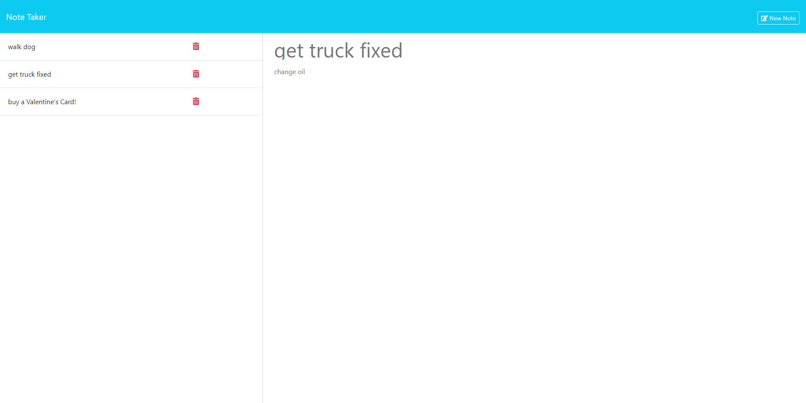

# Note Taker

## Description
The Note Taker App is one that allows users to make notes, click on the existing ones to see the contents, and delete existing ones as well.

## Table of Contents
- [Installation](#installation)
- [Usage](#usage)
- [License](#license)
- [Contributing](#contributing)
- [Tests](#tests)
- [Questions](#questions)
- [Screenshots](#screenshots)
- [Demonstration Video](#video)
- [GitHub Link](#github-link)

## Installation
1. "**Node.js**" must be installed on local machine.
2. Once in your project folder please type "**npm i -y**" for all dependencies.

## Usage
To use the application, enter "**node index.js**" in a CLI of your choosing.  The buttons are intuitive, though on has to watch for how they are changing (especially in the top-right of the app).

## License
This application is licensed by: [MIT](https://opensource.org/licenses/MIT)

## Contributing
You may 'fork' the project in the github repository.

## Tests
n/a

## Questions
If you have any questions, please contact:
-- (https://github.com/harrymac1972)
-- harrymac1972@gmail.com.

## Screenshots

## Demonstration Video
n/a

## GitHub Link
<a href="https://github.com/harrymac1972/note_taker">Note Taker on Github</a>

## Heroku Link
<a href="https://secret-temple-53325-8119dcab1778.herokuapp.com">Note Taker deployed</a>